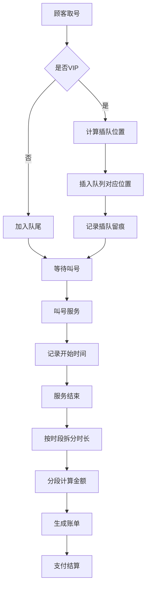

## 1. 产品概述

本系统是面向连锁理发店的企业微信叫号收银应用，解决门店排队管理、VIP优先级插队、时段差异化计费、账单结算等核心业务问题。系统支持多门店协同管理，实现排队透明化、插队留痕可查、计费精准化的运营目标。

- 核心价值：提升门店运营效率，保障VIP客户体验，确保计费公平透明
- 目标用户：门店收银员、理发师、店长、VIP会员

## 2. 核心功能

### 2.1 用户角色

| 角色 | 登录方式 | 核心权限 |
|------|----------|----------|
| 收银员 | 企业微信扫码 | 取号、叫号、插队操作、计费结算、账单查询 |
| 店长 | 企业微信扫码 | 全部收银权限 + 费率配置 + 数据统计 + 插队记录审计 |
| 顾客 | 小程序/H5 | 查看排队状态、取号、查看账单 |

### 2.2 功能模块

1. **排队叫号模块**：取号排队、叫号显示、队列状态管理
2. **优先级插队模块**：VIP插队处理、插队留痕记录、公平性审计
3. **时段计费模块**：时段费率表维护、跨档时长拆分、分段金额合计
4. **账单结算模块**：账单生成、支付结算、账单查询

### 2.3 页面详情

| 页面名称 | 模块名称 | 功能描述 |
|---------|---------|---------|
| 叫号主页 | 排队叫号 | 当前叫号显示、等待队列、取号操作、叫号操作 |
| 插队管理 | 优先级插队 | VIP插队、插队记录查看、公平性留痕 |
| 费率设置 | 时段计费 | 费率表配置、时段管理、价格策略设置 |
| 账单结算 | 账单结算 | 服务结束计费、分段计费展示、支付结算 |
| 账单列表 | 账单结算 | 历史账单查询、账单详情、统计报表 |

## 3. 核心流程

### 3.1 排队叫号流程
顾客到店取号 → 系统根据优先级分配队列位置 → 等待叫号 → 叫号后开始服务 → 服务结束计费

### 3.2 VIP插队流程
VIP顾客取号 → 系统根据VIP等级计算插队位置 → 插入队列并记录插队信息 → 生成插队留痕日志 → 通知被影响顾客

### 3.3 计费结算流程
服务开始记录时间 → 服务结束计算时长 → 按时段费率表拆分跨档时间 → 分段计算金额 → 合计总费用 → 生成账单 → 支付结算

### 3.4 核心流程图

## 4. 用户界面设计

### 4.1 设计风格
- **主色调**：深石墨灰 `#1a1a2e` + 暖金色 `#e6b325`，营造高端理发店氛围
- **辅助色**：米白色 `#f8f5f0`、深棕色 `#3d2914`
- **按钮风格**：圆角矩形，微立体阴影，金色渐变点缀
- **字体**：标题使用 serif 衬线字体提升品质感，正文使用无衬线字体保证可读性
- **布局风格**：卡片式布局，玻璃拟态效果，层次分明
- **图标风格**：线性图标，金色描边，简约精致

### 4.2 页面设计概览

| 页面名称 | 模块名称 | UI元素 |
|---------|---------|-------|
| 叫号主页 | 排队叫号 | 大号当前号码显示、叫号按钮、等待队列列表、取号弹窗 |
| 插队管理 | 优先级插队 | VIP插队表单、插队记录时间线、影响范围展示 |
| 费率设置 | 时段计费 | 费率表格、时段选择器、价格输入、工作日/周末切换 |
| 账单结算 | 账单结算 | 分段计费明细、金额合计、支付方式选择、结算按钮 |
| 账单列表 | 账单结算 | 账单卡片列表、筛选条件、统计汇总 |

### 4.3 响应式
- 桌面端优先设计，适配平板和手机端
- 叫号大屏模式支持全屏展示
- 触控操作优化，按钮尺寸适配移动端

### 4.4 动效设计
- 叫号时数字放大动画 + 轻量音效提示
- 队列位置变更时平滑过渡动画
- 插队操作时留痕记录渐入效果
- 账单结算时金额数字滚动效果
