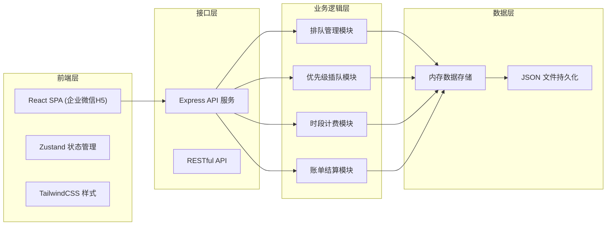
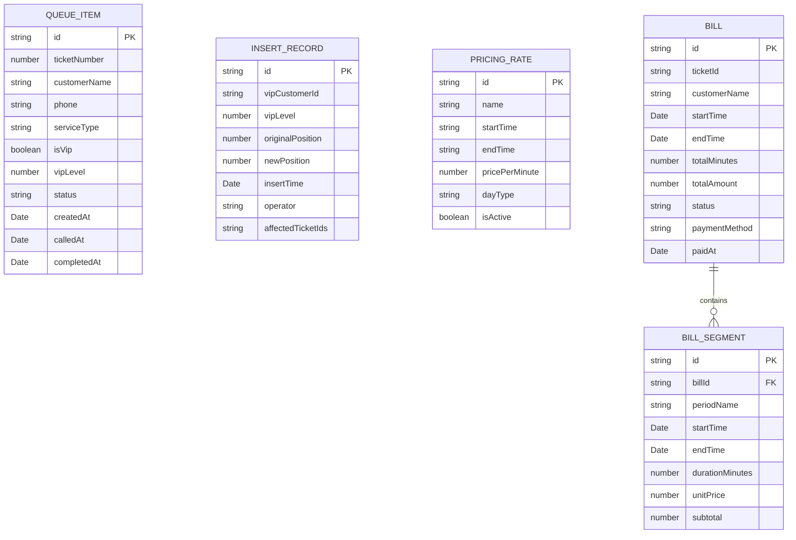

## 1. 架构设计



## 2. 技术选型

- **前端**：React@18 + TypeScript + Vite
- **状态管理**：Zustand
- **样式方案**：TailwindCSS@3
- **图标库**：lucide-react
- **后端**：Express@4 + TypeScript
- **数据存储**：内存数据 + JSON 文件持久化（便于演示，可扩展数据库）
- **路由**：react-router-dom

## 3. 路由定义

| 路由 | 页面名称 | 功能描述 |
|------|---------|---------|
| / | 叫号主页 | 当前叫号显示、等待队列、取号/叫号操作 |
| /queue | 排队管理 | 完整队列视图、顾客详情、状态管理 |
| /vip | VIP插队管理 | VIP插队操作、插队记录、公平性审计 |
| /pricing | 费率设置 | 时段费率配置、价格策略管理 |
| /billing | 账单结算 | 当前服务计费、分段明细、支付结算 |
| /bills | 账单列表 | 历史账单查询、统计报表 |
| /settings | 系统设置 | 门店配置、员工管理 |

## 4. API 接口定义

### 4.1 排队管理

```typescript
// 获取当前队列
GET /api/queue → { queue: QueueItem[], currentNumber: number }

// 取号
POST /api/queue/ticket → { ticket: QueueItem }
Request: { customerName: string, phone: string, serviceType: string, isVip: boolean, vipLevel?: number }

// 叫号
POST /api/queue/call → { calledItem: QueueItem }
Request: { ticketId: string }

// 完成服务
POST /api/queue/complete → { billId: string }
Request: { ticketId: string, endTime: Date }
```

### 4.2 VIP插队管理

```typescript
// VIP插队
POST /api/vip/insert → { newPosition: number, insertedItem: QueueItem, affectedItems: QueueItem[] }
Request: { customerName: string, phone: string, vipLevel: number, serviceType: string }

// 获取插队记录
GET /api/vip/records → { records: InsertRecord[] }
```

### 4.3 费率管理

```typescript
// 获取费率表
GET /api/pricing/rates → { rates: PricingRate[] }

// 更新费率
PUT /api/pricing/rates/:id → { rate: PricingRate }
Request: { startTime: string, endTime: string, pricePerMinute: number, dayType: 'weekday' | 'weekend' }

// 计算费用
POST /api/pricing/calculate → { totalAmount: number, segments: BillingSegment[] }
Request: { startTime: Date, endTime: Date, basePrice?: number }
```

### 4.4 账单管理

```typescript
// 获取账单列表
GET /api/bills → { bills: Bill[], total: number }

// 获取账单详情
GET /api/bills/:id → { bill: Bill }

// 结算账单
POST /api/bills/:id/pay → { bill: Bill, paid: boolean }
Request: { paymentMethod: string, amount: number }
```

## 5. 数据模型

### 5.1 ER图



### 5.2 数据类型定义

```typescript
// 排队项
interface QueueItem {
  id: string;
  ticketNumber: number;
  customerName: string;
  phone: string;
  serviceType: string;
  isVip: boolean;
  vipLevel?: number;
  status: 'waiting' | 'calling' | 'serving' | 'completed' | 'cancelled';
  position: number;
  createdAt: Date;
  calledAt?: Date;
  completedAt?: Date;
  originalPosition?: number;
}

// 插队记录
interface InsertRecord {
  id: string;
  ticketId: string;
  customerName: string;
  vipLevel: number;
  originalPosition: number;
  newPosition: number;
  insertTime: Date;
  operator: string;
  affectedTickets: string[];
  reason?: string;
}

// 费率规则
interface PricingRate {
  id: string;
  name: string;
  startTime: string;  // HH:mm 格式
  endTime: string;    // HH:mm 格式
  pricePerMinute: number;
  dayType: 'weekday' | 'weekend' | 'all';
  isActive: boolean;
  sortOrder: number;
}

// 计费分段
interface BillingSegment {
  id: string;
  periodName: string;
  startTime: Date;
  endTime: Date;
  durationMinutes: number;
  unitPrice: number;
  subtotal: number;
}

// 账单
interface Bill {
  id: string;
  ticketId: string;
  customerName: string;
  phone: string;
  serviceType: string;
  isVip: boolean;
  startTime: Date;
  endTime: Date;
  totalMinutes: number;
  segments: BillingSegment[];
  baseAmount: number;
  totalAmount: number;
  discountAmount: number;
  finalAmount: number;
  status: 'pending' | 'paid' | 'refunded';
  paymentMethod?: string;
  paidAt?: Date;
  createdAt: Date;
}
```

## 6. 核心算法

### 6.1 优先级插队算法
- VIP等级越高，插队位置越靠前
- 同等级VIP按取号时间排序，保证先来后到
- 每次插队记录原始位置和新位置，以及受影响的票号

### 6.2 跨时段计费算法
- 将服务时间段与费率时段逐一比对
- 计算每个费率时段内的服务时长
- 按各时段单价计算费用后累加
- 支持工作日/周末不同费率表
